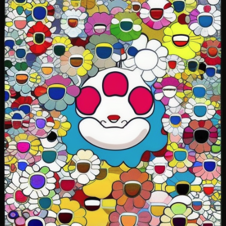

# älykäs

Creative & silly learning with Python and machine learning.

Luovaa ja typerää oppimista Pythonin ja koneoppimisen avulla.

Why? Useless things can bring creativity and perspective.

Miksi? Hyödyttömät asiat voivat tuoda luovuutta ja perspektiiviä.

<i>Image generated with [Stability AI](https://stability.ai/) from [ChatGPT](https://openai.com/) using the notebook in Project 1.</i>

## Project 1: [The Poet & the Artist](https://github.com/shaystrong/alykas/blob/main/the_poet_and_the_artist.ipynb)

### Objective: 

Get 1 computer to communicate to another computer using APIs. Create something visual from text using machine learning and artificial intelligence.

### Background: 
TBD
